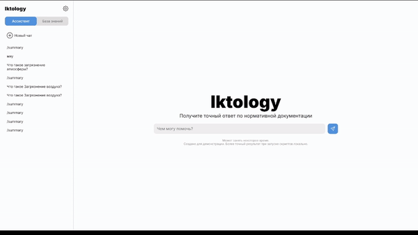

    

<h3 align="center">
    Команда БЕЗУМЦЫ
</h3>

    Окружной хакатон "Цифровой Прорыв: Сезон ИИ" Приволжского Федерального Округа

 
<h1 align="center">
    Iktology
</h3>

Наша команда представляет комплексное решение, помогающее экологам и различным специалистам работать с нормативными, методическими документами для решения различных задач, связанных с контролем окружающей среды. Наше решение представляет из себя платформу Iktology, которое позволит пользователям не только спрашивать у нашего ассистента различные вопросы и получать правильные ответы, но еще позволит работать с документами вручную в более удобном формате, работая на каждом этапе создания отчета с нашим ассистентом. Удобная база знаний (нормативная документация), возможность полной автономной работы, а также комфортность интерфейса — все это делает наше решение уникальным.

-------
## [API](https://github.com/ItsHimReally/Iktology/tree/main/api)
Этот модуль представляет из себя API-интерфейс FastAPI, который отвечает за работу всех моделей. Используется vLLM, LangChain, BGE.  
Документация представлена в виде PyDoc к каждой функции.

## [Web](https://github.com/ItsHimReally/Iktology/tree/main/web)
Веб-модуль обеспечивает пользовательский интерфейс для взаимодействия с системой. Он включает в себя веб-страницы официальной документации в удобном виде, чат с Q/A помощником, инструменты для систематизации данных.

-------
## Инструкции по установке
1. Установите зависимости
2. Запустите uvicorn
3. API запущено, вы великолепны!
> В переменную PATH Tesseract необходимо передать путь к `tesseract.exe`

-------
## Окружение
Наше решение было протестировано на хостах с характеристиками: Intel Xeon (Skylake), RAM 64GB, Nvidia Tesla V100-32GB.

-------

